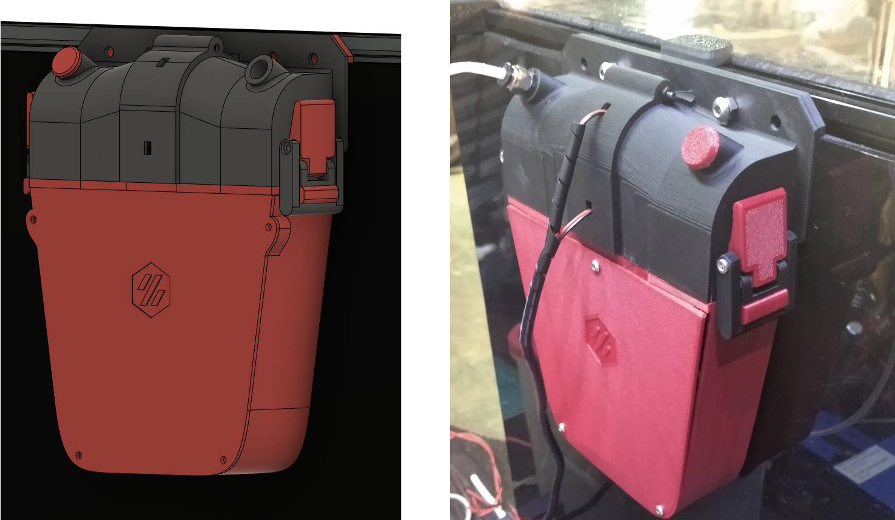
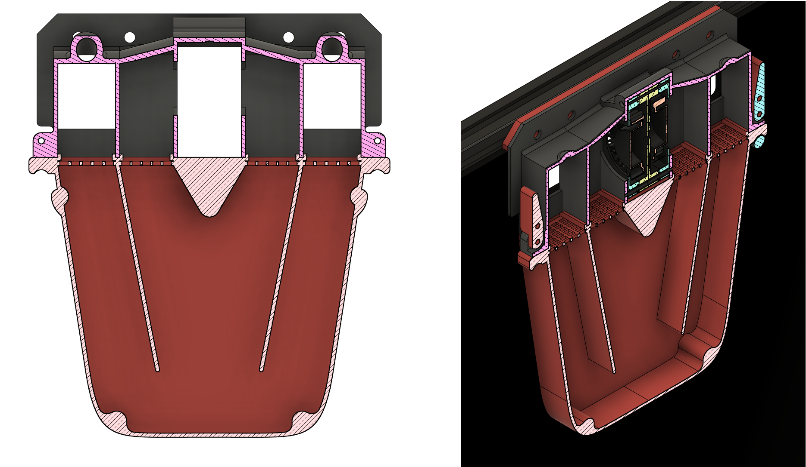

# Quoth Air Filter

This is an internally recirculating air filter system, like Nevermore, but mounted externally. It replaces the air exhaust assembly. Two 5015 fans pull air through a removable cartridge holding filter material.

It comes in two main parts: the fan duct which holds two 5015 fans and a lower removable cartridge that holds the same filter material as the Nevermore.

Air flows in from the sides, down through the filter material, and is pushed out by the fans in the middle. The fans slightly protrude into the printer body, but this does not interfere with the carriages.

## BOM

| Description | Qty | Note |
| ------------- | ------------- |
| M3x6 BHCS (or SHCS)| 4 | Holds the lid to the cartridge body |
| 5x3x4 Heat-set inserts | Holds the lid to the cartridge body |
| M3x(20--22) SHCS | 2 | Holds the clasp to the body, passed through the item. |
| M3x(8--16) SHCS | 4 | Holds the tension arm to the clasp, insert one on each side. |
| M10 Pneumatic Fitting | 1 | For the filament tube, same as in BOM. |
| VHB Tape | 10mm x 200mm | Seal in the sides and bottom of the duct; optional |

## Printing and Installation

Print all parts in STL with standard Voron part settings in ABS, following the numbering and accent conventions. Ensure that your printer can print 45mm long bridges! Smooth bridging will improve the smoothness of the curved ducts, which helps with the airflow. Supports are needed for some external features. If you use the provided supports, they should break away cleanly. If you use your slicer's supports, generate supports touching the bed. 

Feel free to scale the spacer to account for your rear plate and VHB tape (if used).

Fill the cartridge with the same 4mm carbon filter material as the Nevermore. (Purchase in the US: [EnviroSupply](https://smile.amazon.com/gp/product/B00XNXIXAU?th=1)). A cartridge holds about half a pound (~250g) of filter material.

Install two 5015 fans, preferably fans with high static pressure. The flow rate is not crucial. Sunon fans are popular, and [GDSTime fans](https://smile.amazon.com/GDSTIME-Bearing-Brushless-Cooling-Accessory/dp/B08T189FX2/) are adequate and cheap.
